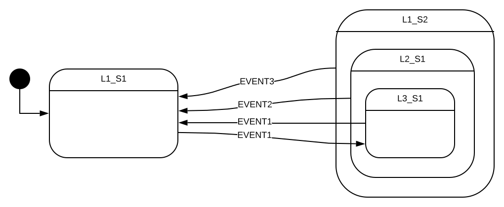

Hierarchical state machine
==========================

## State diagram
This demo contains a hierarchical state machine that contains nested states up to 3 levels as shown below.
It demonstrates the event handling of each state in the nested state and the entry/exit actions on state transition.




## States
This state machine has a total of 4 states.

1. **L1_S1**: This is a simple state.
    - EVENT1    : This event triggers state transition to L3_S1

2. **L1_S2**: This is a composite state and it contains L2_S1 substate.
    - EVENT3    : This event triggers state transition to L1_S1

3. **L2_S1**: This is a substate of L1_S2 composite state. It is also a composite state and contains L3_S1 substate.
    - EVENT2    : This event triggers state transition to L1_S1

4. **L3_S1**: This is a substate of L2_S1 composite state.
    - EVENT1    : This event triggers state transition to L1_S1

## Supported events
- EVENT1
- EVENT2
- EVENT3

## How to use framework

demo.c and demo.h files contain an implementation.

### List of supported events

Define the list of supported events as an enumeration in the header file of your state machine `demo.h`.
event value must be non-zero. Hence initialize the first enum value to 1.
```C
//! List of supported events
typedef enum
{
  EVENT1 = 1,
  EVENT2,
  EVENT3
}demo_event_t;
```

### State machine

Create a structure derived from the `state_machine_t` that contains all the required variables for your state machine.

```C
//! Simple hierarchical state machine
typedef struct
{
  state_machine_t Machine;  //!< Abstract state machine
  uint32_t Dummy1;          //!< Dummy variable
  uint32_t Dummy2;          //!< Dummy variable
}demo_state_machine_t;
```

Make sure that `state_machine_t` must be the first element in the derived structure.

### state

state_t in the hierarchical state machine contains an extra three members compared to a finite state machine.
```C
  const state_t* const Parent;    //!< Parent state of the current state.
  const state_t* const Node;      //!< Child states of the current state.
  uint32_t Level;                 //!< Hierarchy level from the top state.
```

First, define the list of root states of the state machine.
As per the state diagram, there are two root states in the state machine.
First state L1_S1 is a simple state.
Second state L1_S2 is composite state.
```C
// This is an array of root (top most) states .
static const state_t Level1_HSM[] =
{
  {
    level1_state1_handler,          // state handler
    level1_state1_entry_handler,    // Entry action handler
    level1_state1_exit_handler,     // Exit action handler
    NULL,                           // Parent state
    NULL,                           // Child states
    0                               // Hierarchical state level
  },
  {
    level1_state2_handler,          // state handler
    level1_state2_entry_handler,    // Entry action handler
    level1_state2_exit_handler,     // Exit action handler
    NULL,                           // Parent state
    Level2_HSM,                     // Child state
    0                               // Hierarchical state level
  }
};
```

In the above `Level1_HSM` array, index 0 represent the L1_S1 state and index 1 represent L1_S2 state.
As root state doesn't have superstate, `Parent` state of both the states are NULL and hierarchical level is zero
As `Level1_HSM[0]` is a simple state, its `Node` is NULL.
aS `Level1_HSM[1]` is a composite state, its `Node` points to `Level2_HSM`.

Define L2_S1 state. It is a composite state and also substate of L1_S2.

```C
// This is an array of substates of Level1_HSM[1] composite state.
static const state_t Level2_HSM[] =
{
  {
    level2_state1_handler,          // state handler
    level2_state1_entry_handler,    // Entry action handler
    level2_state1_exit_handler,     // Exit action handler
    &Level1_HSM[1],                 // Parent state
    &Level3_HSM[0],                 // Child state
    1                               // Hierarchical state level
  }
};
```

`Level2_HSM` array contains only one state that represents L2_S1.
The `parent` points to the 2nd index of `Level1_HSM` array.
Hierarchical level is 1. `Node` points to Level3_HSM.

Define L3_S1 state. It is a substate of L2_S1.
```C
// This is an array of substates of Level2_HSM[0] composite state.
static const state_t Level3_HSM[] =
{
  {
    level3_state1_handler,          // state handler
    level3_state1_entry_handler,    // Entry action handler
    level3_state1_exit_handler,     // Exit action handler
    &Level2_HSM[0],                 // Parent state
    NULL,                           // Child state
    2                               // Hierarchical state level
  }
};
```

`Level3_HSM` array contains only one state that represents L3_S1.
The `parent` points to `Level2_HSM[0]` (L2_S1) state.
Hierarchical level is 2. It is a simple state, hence `Node` is NULL.

### event handler, entry and exit actions

Define event handler, entry and exit action's based on following function signature
```C
typedef state_machine_result_t (*state_handler) (state_machine_t* const state);
```

If handler supports the passed event, then it consumes the event and returns the result as `EVENT_HANDLED`.
Else if handler doesn't support the passed event it returns the result as `EVENT_UN_HANDLED` and framework passes that event to its superstate.
This continues till framework reaches to root state.
If root state also doesn't support the event then framework returns the error `EVENT_UN_HANDLED`.
If the handler consumes the event and generates the new event then return the status as `TRIGGERED_TO_SELF`.

### State transition

Use `traverse_state` for traversing from source state to target state.

