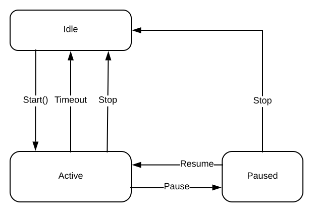

Simple state machine
====================

This example demonstrate a simple state machine of a process as shown below.



### The process has 3 states
1. Idle state  
This state waits for the **Start** event to occur. On **Start** event,
  it starts the process for defined period and switch to Active state.

2. Active state  
This state supports **Stop**, **Pause** and **Timeout** events.
  - The stop event causes the process to stop and return to idle state.
  - The Pause event causes the process to pause and switch to Paused state.
  - When process period elapses it triggers the **Timeout** event.
    The **Timeout** event causes the process to stop and return to idle state.

3. Paused state  
This state supports **Resume** and **Stop** events.
  - The Resume event causes the process to resume and returns to active state.
  - The Stop event causes the process to stop and switch to Idle state.

### Total supported events in the process are,
1. Start
2. Stop
3. Pause
4. Resume
5. Timeout


How to use framework
--------------------
process.c and process.h files contains an implementation of demo state machine.

### Configure framework to finite state machine only.

1. Compiler configuration
  - Define `HSM_CONFIG` in the compiler preprocessor (-D option) to include hsm_config.h file.
  - Provide the `hsm_config.h` and `hsm.h` file path in the compiler include path option (-I).
2. Disable hierarchical state machine support by setting `HIERARCHICAL_STATES` to 0.
3. Set `STATE_MACHINE_LOGGER` to 1 to enable logging of state machine for debug purpose.

### List of supported events

Define the list of supported events as enumeration in the header file of your state machine `process.h`.
event value must be non-zero. Hence initialize the first enum value to 1.
```C
//! List of process events
typedef enum
{
  START = 1,
  STOP,
  PAUSE,
  RESUME,
  TIMEOUT,
}process_event_t;
```

### State machine

Create a structure derived from the `state_machine_t` that contains all the required variables for your state machine.

```C
//! process state machine
typedef struct
{
  state_machine_t;      //!< Abstract state machine
  uint32_t Set_Time;    //! Set time of a process
  uint32_t Resume_Time; //!< Remaining time when the process is paused
  uint32_t Timer;       //!< Process timer
}process_t;
```
Make sure that `state_machine_t` must be the first element in the derived structure.

### state

Define the list of states as enumeration in the source file of state machine `process.c`.

```C
//! List of states the process state machine
typedef enum
{
  IDLE_STATE,
  ACTIVE_STATE,
  PAUSE_STATE
}process_state_t;
```
Create a structure of states and initialize it with handlers.

```C
static const state_t Process_States[] =
{
  [IDLE_STATE].Handler = idle_handler,
  [IDLE_STATE].Entry   = idle_entry_handler,
  [IDLE_STATE].Exit    = idle_exit_handler,
  [IDLE_STATE].Id      = IDLE_STATE,

  [ACTIVE_STATE].Handler = active_handler,
  [ACTIVE_STATE].Entry   = active_entry_handler,
  [ACTIVE_STATE].Exit    = active_exit_handler,
  [ACTIVE_STATE].Id      = ACTIVE_STATE,

  [PAUSE_STATE].Handler = paused_handler,
  [PAUSE_STATE].Entry   = paused_entry_handler,
  [PAUSE_STATE].Exit    = paused_exit_handler,
  [PAUSE_STATE].Id      = PAUSE_STATE,
};
```
each state has function pointers to its event handler, entry and exit actions.
If logger is enabled, then initialize the Id with respective state enum `process_state_t` as unique id.
The event handler must be initialized for each state.
the entry and exit actions are optional, if not required then can be initialized as NULL.

### event handler, entry and exit actions

Define event handler, entry and exit action's based on following function signature
```C
typedef state_machine_result_t (*state_handler) (state_machine_t* const state);
```

If handler supports the passed event then consume the event and return status as `EVENT_HANDLED`.
Use `switch_state` for the event that triggers state transition.
If handler doesn't support the passed event then return result as `EVENT_UN_HANDLED`.
If the handler consumes the event and generates the new event then return the status as `TRIGGERED_TO_SELF`.

