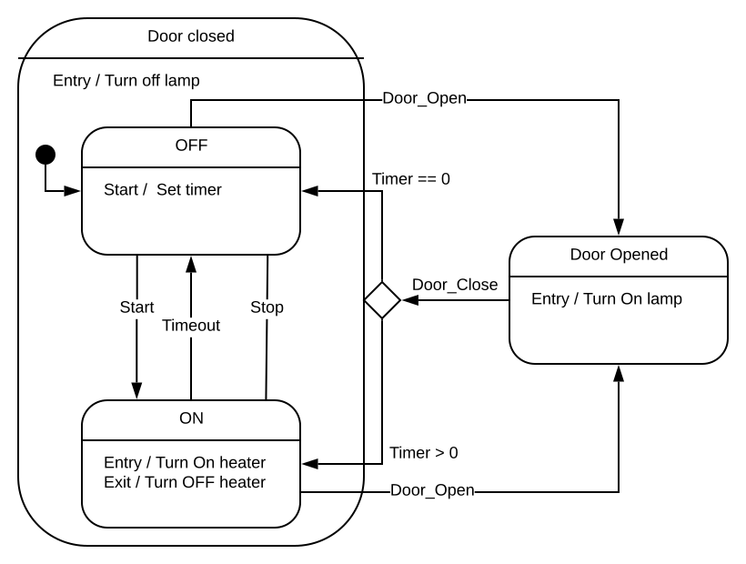

Toaster Oven state machine
==========================

## State diagram
This example demonstrates a hierarchical state machine of a toaster oven as shown below.



## States
### 1. Door Close state
This is a composite state and contains two substates.
- **Entry action**: Turn off the oven lamp.

#### a. Off state
This state represents that oven is off. Supported events are events are,
- **Start**     : This event turn on the heater and heating timer.
                  It also triggers the state transition to On state.
- **Door_Open** : This event turns off the heater and pauses the heating timer.
                  It also triggers the state transition to Door open state.

#### b. On state
This state represents oven is on (i.e. heater is on and timer is running).
- **Entry action**: Turn on the heater.
- **Exit action** : Turn off the heater.
- **Stop**        : This event turns off the heater and heating timer.
                    It also triggers the state transition to off state.
- **TimeOut**     : This event turns off the heater and triggers the state transition to off state.
- **Door_Open**   : This event pauses the triggers the state transition to Door open state.

### 2. Door Open state
This state supports **Door_Close** event.
- **Entry action**: Turn on the oven lamp.
- **Door_Close**  : This event triggers the state transition based on the resume timer.
                   If resume time is greater than zero then it traverses to on state else it to off state.

## Supported events
1. Start
2. Stop
3. Door_Open
4. Door_Close
5. Timeout

## How to use framework

toaster_oven.c and toaster_oven.h files contain an implementation of oven state machine.

### List of supported events

Define the list of supported events as an enumeration in the header file of your state machine `toaster_oven.h`.
event value must be non-zero. Hence initialize the first enum value to 1.
```C
//! List of oven events
typedef enum
{
  EN_START = 1,
  EN_STOP,
  EN_DOOR_OPEN,
  EN_DOOR_CLOSE,
  EN_TIMEOUT,
}oven_event_t;
```

### State machine

Create a structure derived from the `state_machine_t` that contains all the required variables for your state machine.

```C
//! Oven state machine
typedef struct
{
  state_machine_t Machine;  //!< Abstract state machine
  uint32_t Set_Time;        //!< Set time of a oven
  uint32_t Resume_Time;     //!< Remaining time when the oven is paused
  uint32_t Timer;           //!< Oven timer
  bool Lamp;                //!< Oven lamp
  bool Heater;              //!< Oven heater
}oven_t;
```
Make sure that `state_machine_t` must be the first element in the derived structure.

### state

state_t in the hierarchical state machine contains an extra three members compared to finite state machine.
```C
  const state_t* const Parent;    //!< Parent state of the current state.
  const state_t* const Node;      //!< Child states of the current state.
  uint32_t Level;                 //!< Hierarchy level from the top state.
```

This demo uses macro to define the states. This macro make code more readable and maintainable
and also reduces manual hardcoding of data.

```C
#define ADD_ROOT(NAME, HANDLER, ENTRY, EXIT, CHILD)
```
Use this macro to add root state to the state machine. `DOOR_CLOSE_STATE` is defined using this macro.
  - This state doesn't contain parent state.
  - Level is zero
  - It is composite state and contains substates.
---

```C
#define ADD_ROOT_LEAF(NAME, HANDLER, ENTRY, EXIT)
```
  - This state doesn't contain parent state. `ADD_ROOT_LEAF` is defined using this macro.
  - Level is zero
  - It is a simple state and doesn't contains substates.
---

```C
#define ADD_LEAF(NAME, HANDLER, ENTRY, EXIT, PARENT, LEVEL)
```
Use this macro to add leaf state to the composite state. `OFF_STATE` and `ON_STATE` are defined using this macro.
  - It is a simple state and doesn't contains substates.
---

```C
#define ALL_OVEN_STATES	\
	ADD_ROOT_LEAF(DOOR_OPEN_STATE, door_open_handler, door_open_entry_handler, NULL)	\
	ADD_ROOT(DOOR_CLOSE_STATE, NULL, door_close_entry_handler, NULL, Door_Close_State) \

#define ALL_DOOR_CLOSED_STATES(PARENT, LEVEL)	\
	ADD_LEAF(OFF_STATE, off_handler, off_entry_handler, NULL, PARENT, LEVEL)	\
	ADD_LEAF(ON_STATE, on_handler, on_entry_handler, on_exit_handler, PARENT, LEVEL)
```

These macro's are used for creating the enumeration of `oven_state_t` and `door_close_state_t`.
Also to initialize the state_t structures `Oven_State` and `Door_Close_State`.

each state has function pointers to its event handler, entry and exit actions.
The event handler must be initialized for each state.
the entry and exit actions are optional, if not required then can be initialized as NULL.

### event handler, entry and exit actions

Define event handler, entry and exit action's based on following function signature
```C
typedef state_machine_result_t (*state_handler) (state_machine_t* const state);
```

If handler supports the passed event, then it consumes the event and returns the status as `EVENT_HANDLED`.

Use `switch_state` to switch state when the source state and target state have same parent state.
e.g. switch from `OFF_STATE` to `ON_STATE` and vice versa.

Use `traverse_state` for traversing from source state to target state when both have different parent state.
e.g. switch from `DOOR_OPEN_STATE` to `OFF_STATE` / `ON_STATE` and vice versa.

If handler doesn't support the passed event then return result as `EVENT_UN_HANDLED`.
If the handler consumes the event and generates the new event then return the status as `TRIGGERED_TO_SELF`.

